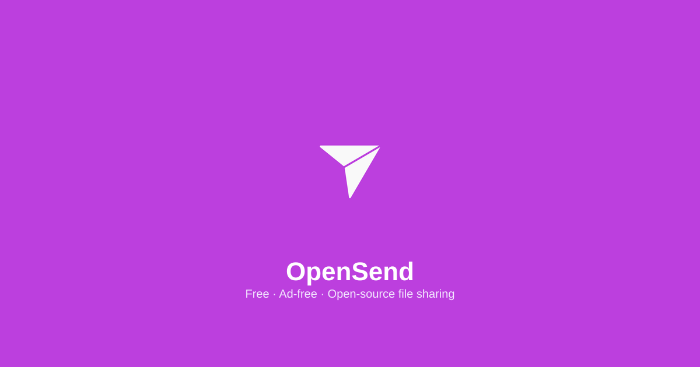

  <picture>
    <source media="(prefers-color-scheme: dark)" srcset="assets/branding/opensend-icon.png">
    
  </picture>
  <h1 align="center">OpenSend</h1>
  

    <strong>Free · Ad-free · Open-source file sharing</strong>
     
    A clean alternative to SHAREit, Send Anywhere, and WeTransfer.
     
    Send files directly between devices. No account required.
  

   

  

 

 

---

## Gallery

> _Screenshots coming soon — see the app in action at [send.kovina.org](https://send.kovina.org)._

  
  
    
  
  
  

 

---

## Why OpenSend

File sharing shouldn't require an account, a subscription, or handing over your data. OpenSend lets you send files between any devices — phone to laptop, desktop to tablet — with zero setup, zero cost, and zero data collection.

No sign-ups. No file size limits disguised as "premium tiers." Just a QR code or a 6-character code, and your files move directly.

 

---

## Features

| | |
|---|---|
| **No account required** — open and send instantly | **Direct device-to-device** — files never touch a cloud server |
| **QR pairing & pair codes** — scan to connect or enter a 6-character code | **Multi-file transfer** — send up to 20 files at once (any type, mixed formats) |
| **Two transfer methods** — Direct Transfer (WebRTC P2P) and Cloud Transfer (temporary upload) | **Up to 50 MB per file** — 20 files max per batch |
| **Cross-platform** — Windows, Android, iOS, macOS, Linux, Web | **Free & ad-free** — always |
| **Open-source** — AGPLv3 | **Desktop app** — Electron wrapper for Windows (store-ready) |

 

---

## Designed For

**People who need to send files to someone else — right now.**

- **Families** sharing photos without uploading to a cloud service
- **Coworkers** exchanging documents without email size limits
- **Anyone** transferring files between their own devices

 

---

## Design Philosophy

> _"A transfer terminal — not a dashboard."_

Every screen has one purpose. Dark-mode first, true black canvas. Pill buttons. Editorial typography. No cards, no dashboard widgets. Receipt/ticket pattern for results.

OpenSend is built with the [Design Playbook](DESIGN_PLAYBOOK.md). Brand color: `#BC3FDE` — vibrant purple.

 

---

## Built With

  
  
  
  
  
  
  
  

 

---

## Version Journey

| Version | Date | Highlights |
|---------|------|------------|
| **v0.7.0** | 2025-06-25 | Electron desktop app, NSIS installer, MSIX package, file associations |
| **v0.6.0** | 2025-06-25 | Android (Capacitor 8), Play Store assets, deep links |
| **v0.5.0** | 2025-06-25 | PWA production, offline support, full PWA lifecycle |
| **v0.4.0** | 2025-06-20 | Cloud transfer with Supabase Storage, claim codes |
| **v0.3.0** | 2025-06-15 | WebRTC direct transfer, QR pairing |
| **v0.2.0** | 2025-06-10 | Pair codes, multi-file support |
| **v0.1.0** | 2025-06-05 | Initial release — send flow, QR pairing |

[Full Changelog](CHANGELOG.md)

 

---

## License

AGPLv3 — see [LICENSE](LICENSE)

Built by [@sparshsam](https://github.com/sparshsam)

 

---

## Part of the Open Collection

  <table>
    <tr>
      <td align="center" width="200">
         
        <strong>OpenPalette</strong> 
        A color studio for designers 
        <a href="https://github.com/sparshsam/openpalette">Repo</a> ·
        <a href="https://palette.kovina.org">Web</a>
      </td>
      <td align="center" width="200">
         
        <strong>OpenSend</strong> 
        Free file sharing, no account needed 
        <a href="https://github.com/sparshsam/opensend">Repo</a> ·
        <a href="https://send.kovina.org">Web</a>
      </td>
      <td align="center" width="200">
         
        <strong>OpenSprout</strong> 
        Plant care records 
        <a href="https://github.com/sparshsam/opensprout">Repo</a> ·
        <a href="https://sprout.kovina.org">Web</a>
      </td>
      <td align="center" width="200">
         
        <strong>OpenTone</strong> 
        Offline music library 
        <a href="https://github.com/sparshsam/OpenTone">Repo</a>
      </td>
    </tr>
  </table>

  <a href="https://github.com/sparshsam?tab=repositories&q=open&type=public">View all Open* repositories →</a>

